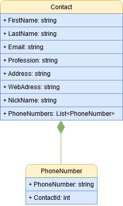
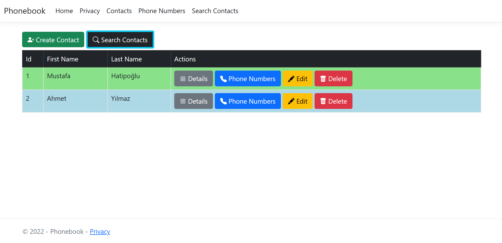
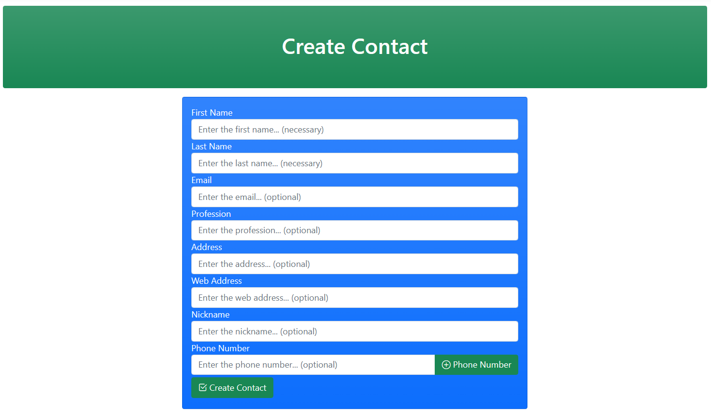
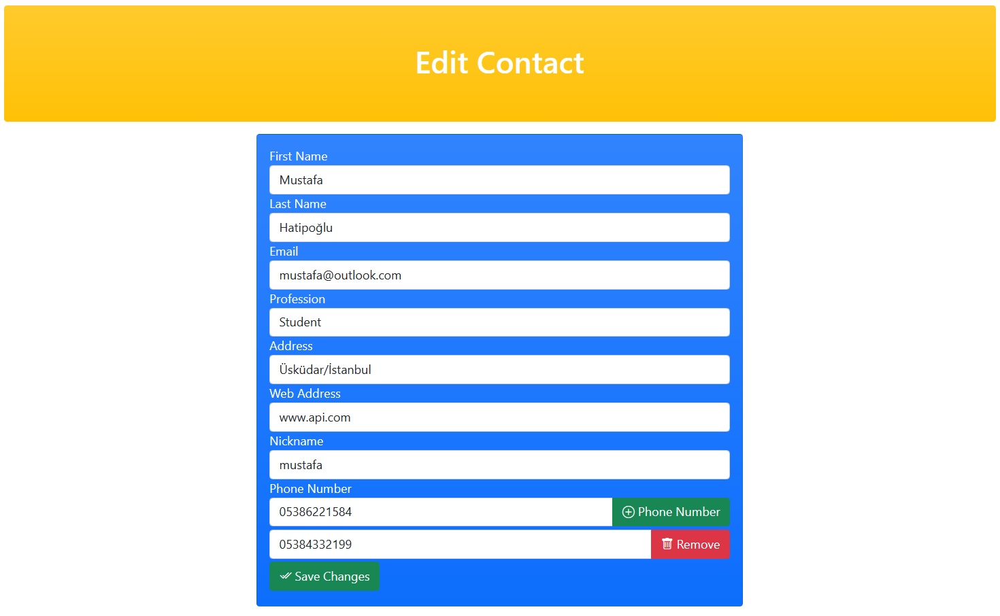
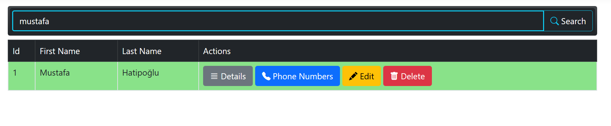
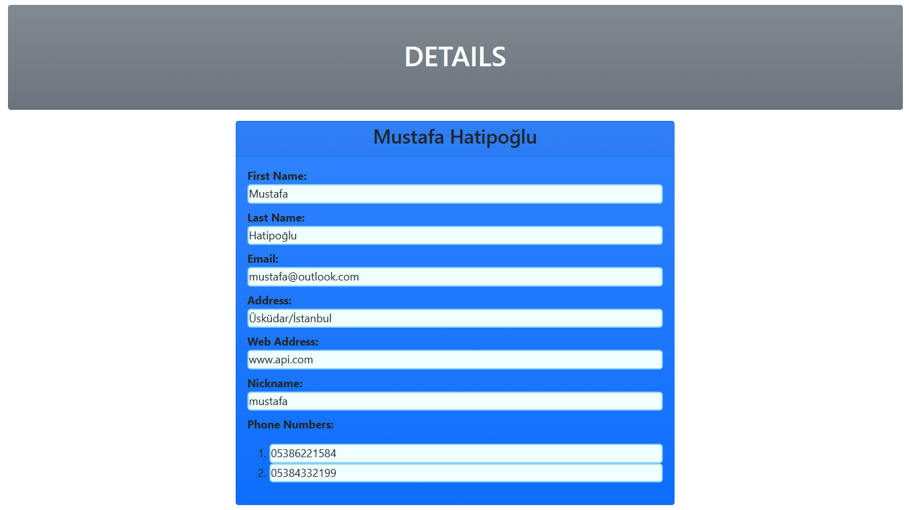
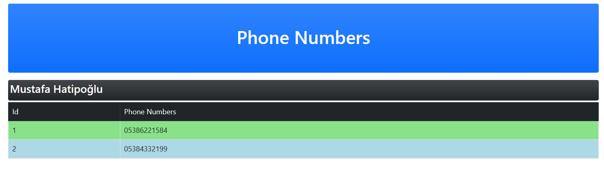
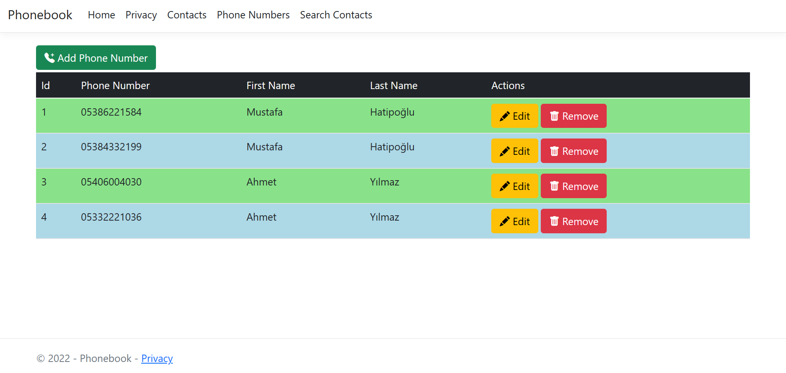
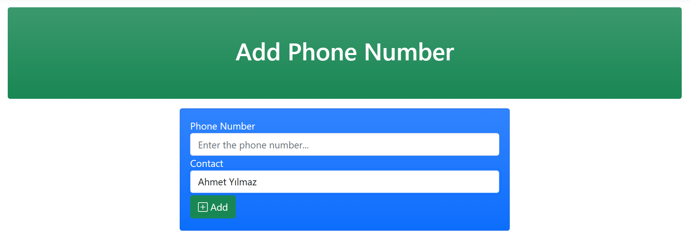

# Simple Phonebook Application

> 2022 Summer Internship Project

A Simple Phonebook Application that uses ASPNET.CORE MVC. In this Phonebook application, you can create, update, and remove contacts and their phone numbers.

There are two classes: ``Contact`` and ``PhoneNumber``. There are **one-to-many** relationship between ``Contact`` and ``PhoneNumber``. The following image shows this relationship and fields.

> In ``Contact`` class, *all fields are optional except **FirstName** and **LastName***

## Libraries Used

**AutoMapper** used to convert ViewModels to Models

**FluentValidation** used to validation processes

**Autofac** used to dependency injection

## Pages

#### Contact Home Page

#### Contact Create Page

#### Contact Edit Page

#### Contact Search Page

#### Contact Details Page

#### Contact Phone Numbers Page

#### Phone Number Home Page

#### Phone Number Create Page

#### Phone Number Edit Page

